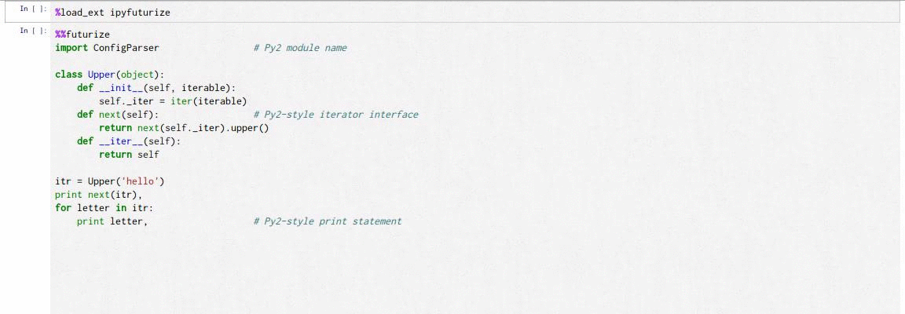
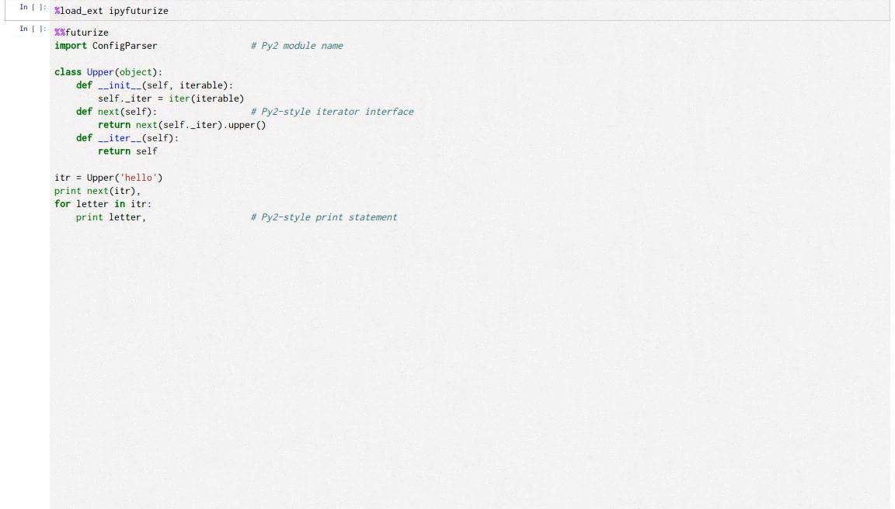

# ipyfuturize

A cell magic for [futurize](http://python-future.org/futurize.html) (based on [2to3](https://docs.python.org/2/library/2to3.html))

## usage & demo

`Ctrl-Enter` overwrites the active cell (`Ctrl-z` will undo)



`Ctrl-Shift-Enter` writes to a new cell



Line arguments are passed directly to the `futurize` script.

Executing `%%futurize?` will show the same help info as `!futurize --help`.

If you're using a virtual environment it will attempt to find the `futurize` script at `$VIRTUAL_ENV/bin/futurize`, otherwise it assumes the one you want to use is in `$PATH`.

No windows support.

## install

```
%install_ext https://raw.github.com/douglas-larocca/ipyfuturize/master/ipyfuturize.py
```

then

```
%load_ext ipyfuturize
```

and use with

```
%%futurize
```

Also see the [demo notebook](demo.ipynb)
